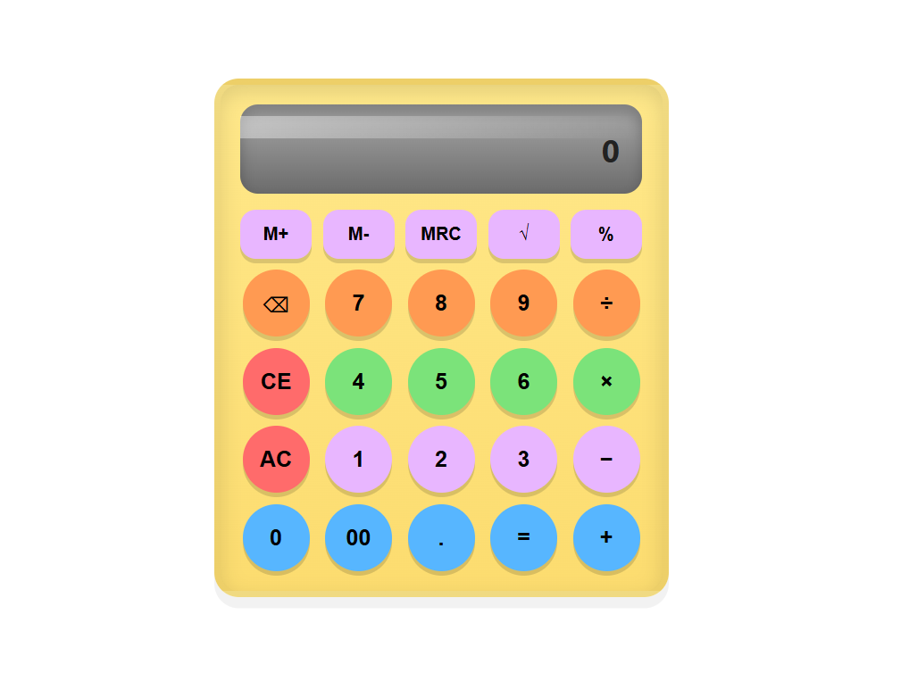

# Basit Hesap Makinesi (2023)

> Bu proje, **HTML**, **CSS** ve **JavaScript** kullanılarak geliştirilmiş basit bir **hesap makinesi uygulamasıdır**.
> 2023 yılında yapılmış kişisel bir uygulama geliştirme çalışmasıdır.
- Amaç, temel hesaplama mantığını renkli ve düzenli bir arayüzle birleştirmektir.

---

## 📸 Ekran Görüntüsü 
> Genel görünüm:  
> 

---

## 🧠 Özellikler
- Toplama, çıkarma, çarpma ve bölme işlemleri  
- Kareköklü hesaplama (√)  
- Yüzde hesaplama (%)  
- Hafıza işlemleri (M+, M-, MRC)  
- CE, AC ve silme (⌫) fonksiyonları  
- Renkli ve kullanıcı dostu buton düzeni  
- Responsive tasarım (farklı ekranlara uyumlu)

---

## 📂 Proje Yapısı

calculator/

│

├── index.html # Ana HTML dosyası

├── calculator.css # Arayüz tasarımı (renkli butonlar, grid yapısı)

├── calculator.js # Hesaplama mantığı ve buton işlevleri

└── screenshot.png # (isteğe bağlı) Ekran görüntüsü

---

*Bu proje ticari olmayan, öğrenme amaçlı eski bir çalışmadır.*

